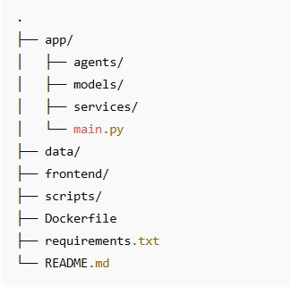
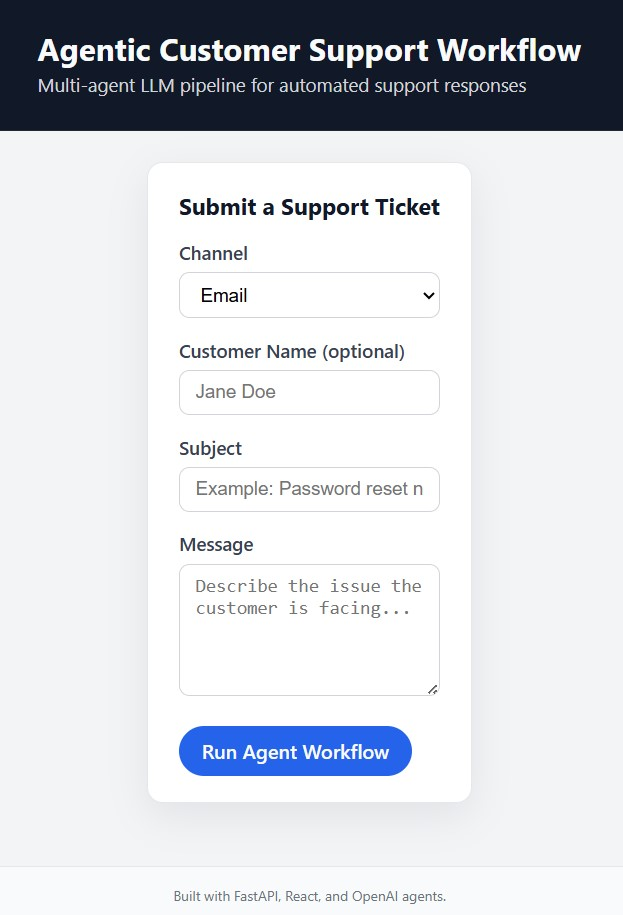
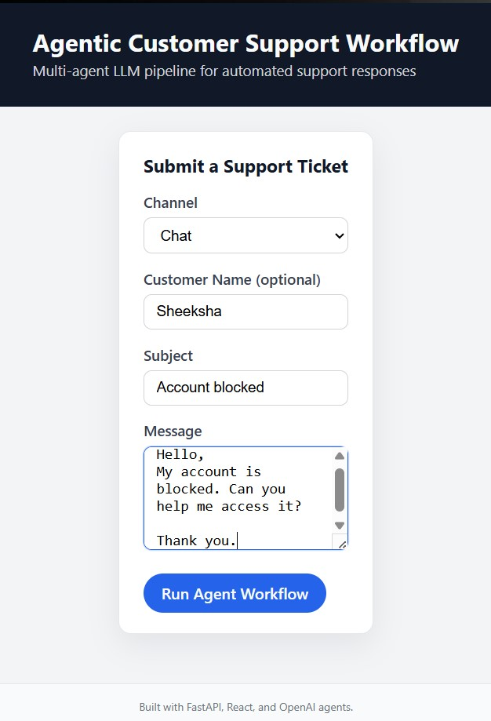
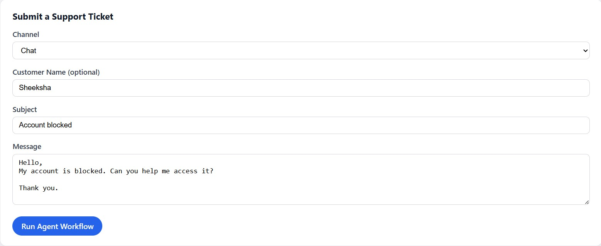
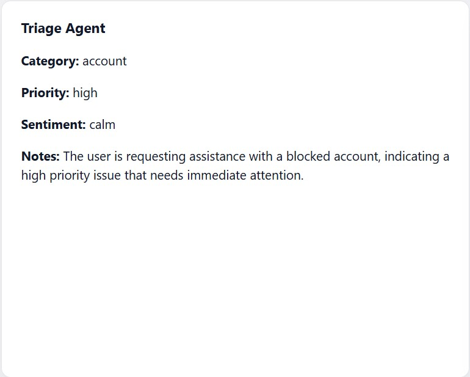
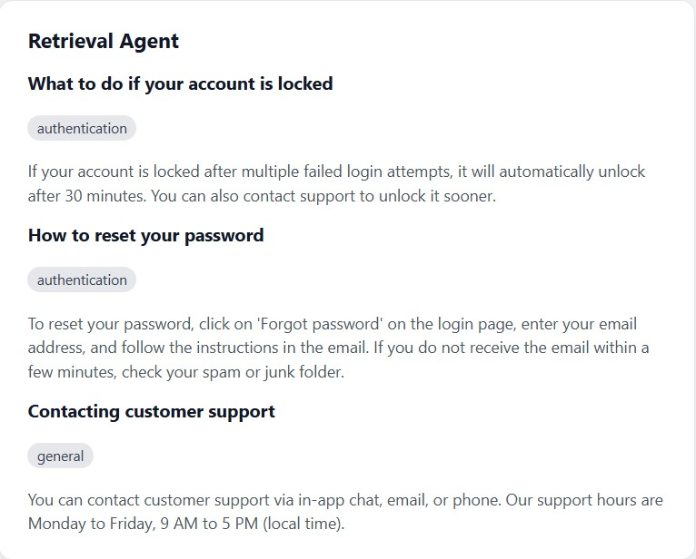
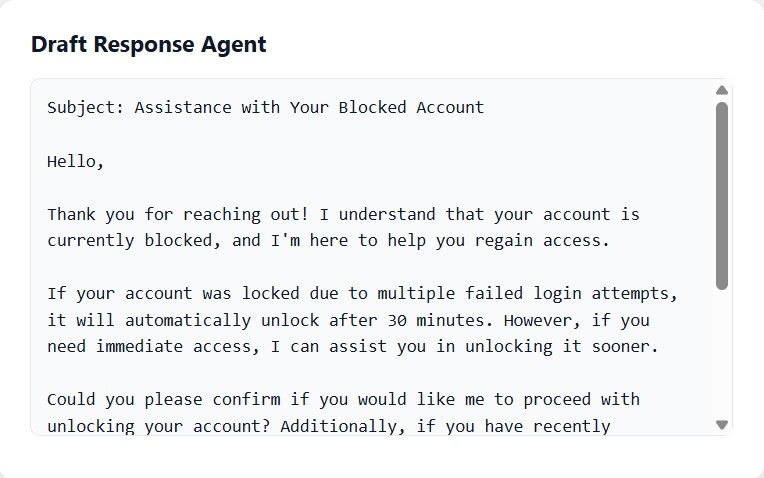
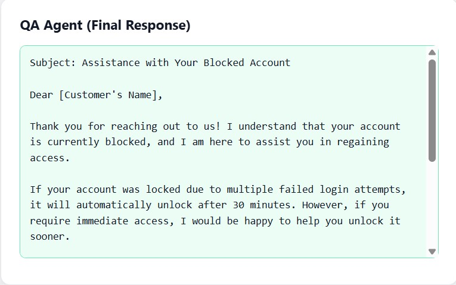
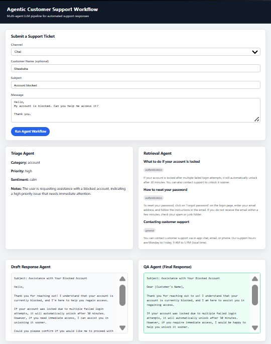

# Agentic Workflow for Customer Support Automation

A production-ready multi-agent LLM system for automating customer support ticket processing. Built with FastAPI, LangChain, OpenAI, NumPy embeddings, and React, and deployed on Netlify.

## 🌐 Live Demo
- Frontend: https://agentic-1.netlify.app/
- Backend: https://agentic-support-api.onrender.com/

## Overview
This project implements a multi-agent workflow that automates the end-to-end processing of customer support tickets using LLM-powered agents. It replicates how real enterprise support systems triage, retrieve knowledge, draft replies, and refine responses, fully automated.

Agents work collaboratively:
1. **Triage Agent** – Classifies ticket category, priority, and customer sentiment
2. **Retrieval Agent** – Performs semantic search over an internal knowledge base
3. **Draft Agent** – Generates a first response using ticket + KB context
4. **QA Agent** – Improves tone, clarity, and correctness


## Architecture
The workflow is exposed via a REST API and displayed in a React dashboard.

<p align="center">
  
</p>

## Agents in Detail
### 1. Triage Agent
Classifies a ticket into:
- Category (billing, authentication, features, etc.)
- Priority (low → urgent)
- Sentiment (calm, frustrated, angry)
- Notes for internal use

Uses OpenAI (gpt-4o-mini) via LangChain.

### 2. Retrieval Agent
Performs semantic search over kb_articles.json.
- ✔ Uses OpenAIEmbeddings
- ✔ Numpy-based cosine similarity search
- ❌ No FAISS or external vector DB needed
- ✔ Lightweight + container-friendly

### 3. Draft Agent
Creates a first-pass customer response by combining:
- Original ticket
- Triage data
- Retrieved knowledge base snippets

Writes like a helpful support representative.

### 4. QA Agent
Improves:
- Tone
- Clarity
- Professionalism
- Grammar

Returns the final customer-facing answer.


## API Endpoints
1. `GET /health`

**Health check**

Response: `{ "status": "ok" }`

2. `POST /process`

Run the entire multi-agent workflow.

**Request**
```
{
  "channel": "email",
  "customer_name": "Jane Doe",
  "subject": "Password reset not working",
  "message": "I'm not receiving the reset email."
}
```

**Response (Structure)**
```
{
  "triage": { ... },
  "retrieved_articles": [ ... ],
  "draft": { "draft_text": "..." },
  "final": { "final_text": "..." }
}
```

## Tech Stack
**Backend**
- FastAPI
- LangChain (core + OpenAI)
- NumPy (embeddings search)
- Uvicorn
- Python 3.11

**Frontend**
- React (Vite)
- CSS
- Fetch API (no extra libs)

**Deployment**
-Backend: Render (Docker)
- Frontend: Netlify
- CI/CD: GitHub → Automatic deploys


## Local Deployment
### Backend
```
git clone <repo>
cd agentic-customer-support-workflow
python -m venv .venv
.\.venv\Scripts\activate
pip install -r requirements.txt
uvicorn app.main:app --reload
```

### Frontend
```
cd frontend
npm install
npm run dev
```

## Project Structure

<p align="center">
  
</p>

## Demo images
Below are selected screenshots from the live demo showing the agentic workflow in action.

---

### 1. Ticket Submission (Frontend UI)
This is where the user submits a customer support ticket.

<p align="center">
  
</p>

<p align="center">
  
</p>

<p align="center">
  
</p>
---

### 2. Triage Agent Output
The ticket is analyzed for category, priority, and sentiment.

<p align="center">
  
</p>

---

### 3. Knowledge Base Retrieval
The system retrieves the top relevant articles using semantic search.

<p align="center">
  
</p>

---

### 4. Draft Response (Agent 3)
LLM generates the initial draft response.

<p align="center">
  
</p>

---

### 5. Final Polished Response (QA Agent)
The QA agent returns the final customer-ready reply.

<p align="center">
  
</p>

---

### 6. Full Workflow (Collapsed View)
All steps of the pipeline displayed together.

<p align="center">
  
</p>


## Use Cases
- AI-driven support automation
- Multi-agent systems
- Customer operations
- Enterprise LLM workflows
- AI engineering demos


## Future Enhancements
- Multi-turn dialog support
- Streaming responses
- Elasticsearch vector DB
- Agent memory
- User authentication
- Admin dashboard

